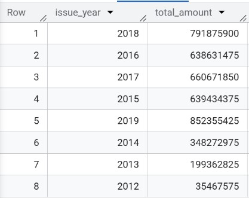
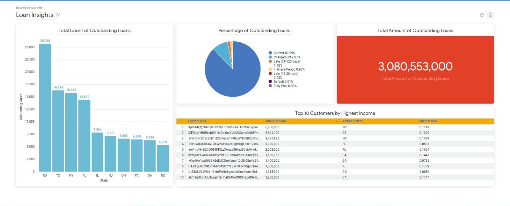
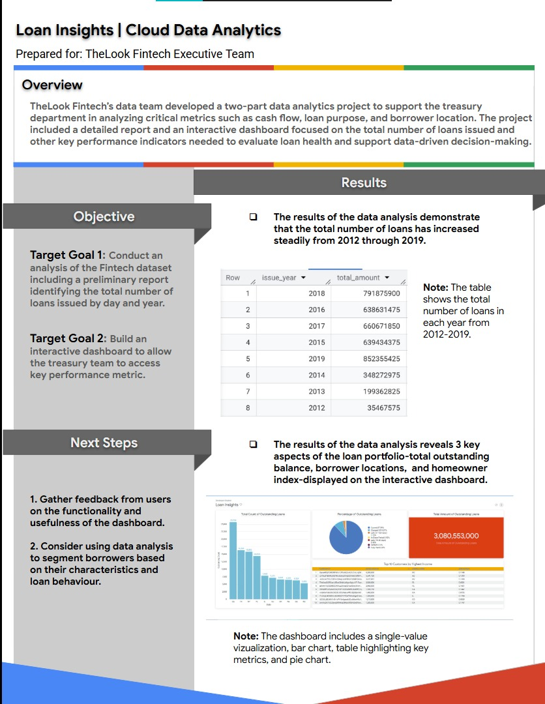

# ☁️ GCP Loan Analytics — Cloud Data Analytics Capstone

> BigQuery · Looker Studio · Google Cloud Platform

A cloud-native data analytics project developed for TheLook Fintech's
treasury department as part of the Google Cloud Data Analytics Capstone.
The project analyzes a $3B+ outstanding loan portfolio to surface key
performance indicators around loan health, borrower behavior, and
regional distribution — delivered as an executive report and an
interactive Looker Studio dashboard.

---

## 🎯 Project Objectives

**Goal 1** — Analyze the Fintech dataset and produce a preliminary
report identifying total loans issued by day and year.

**Goal 2** — Build an interactive dashboard to allow the treasury
team to monitor key performance metrics in real time.

---

## 🛠️ Tech Stack

| Tool | Purpose |
|------|---------|
| BigQuery | Cloud data warehouse and SQL analysis |
| Looker Studio | Interactive dashboard and visualization |
| Google Cloud Platform | Cloud infrastructure and data storage |
| SQL | Querying and aggregating loan data |

---

## 🔍 Analysis & Results

### Loan Volume by Year (BigQuery)
Queried total loan amounts issued per year from 2012–2019.
Loan volume grew steadily from $35M in 2012 to a peak of $852M
in 2019 — an approximately 24x increase over 7 years.

---

### Looker Studio Dashboard — Loan Insights
Built an interactive dashboard covering 3 key aspects of the
loan portfolio:

- **Total Outstanding Loans** — $3,080,553,000 across all borrowers
- **Loan Status Breakdown** — 87.89% Current, 9.07% Charged Off,
  1.72% Late (31–120 days), 0.90% In Grace Period
- **Geographic Distribution** — California leads with 25,730
  outstanding loans, followed by Texas (16,344) and New York (15,892)
- **Top 10 Customers by Highest Income** — ranked by annual income
  with corresponding interest rates and home states

---

### Executive Summary
Delivered a formal executive report prepared for TheLook Fintech's
treasury team summarizing methodology, findings, and dashboard
functionality.

---

## 💡 Key Insights

- Loan issuance grew **24x from 2012 to 2019** — reflecting rapid
  portfolio expansion
- **87.89% of loans are current** — indicating a healthy portfolio
  with manageable default risk at 0.01%
- **California accounts for the highest loan concentration** — a
  potential geographic risk factor for the portfolio
- **Top borrowers carry annual incomes up to $6.2M** with interest
  rates ranging from 5% to 17% — showing wide risk-tier distribution

---

## 📚 Skills Demonstrated

- Cloud-based data analysis using BigQuery and GCP
- SQL aggregation and time-series analysis on large datasets
- Interactive dashboard design in Looker Studio
- Translating financial data into executive-level insights
- Formal report writing for business stakeholders

---

## 👨‍💻 Author

**Kaviraj Desai**
- LinkedIn: [linkedin.com/in/kavirajdesai](https://linkedin.com/in/kavirajdesai)
- GitHub: [github.com/kavirajdesai](https://github.com/kavirajdesai)
